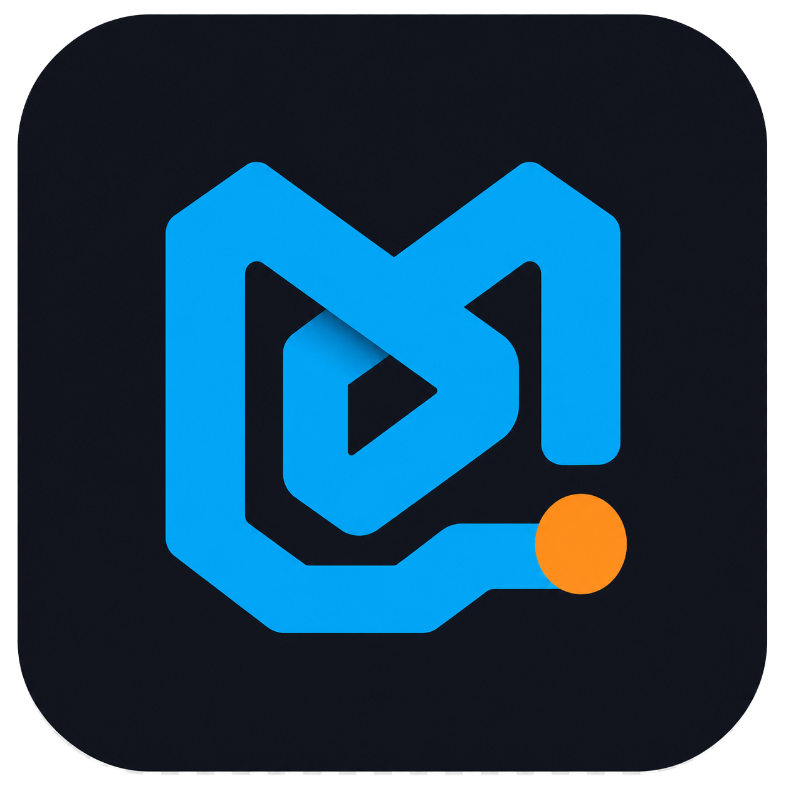
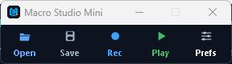
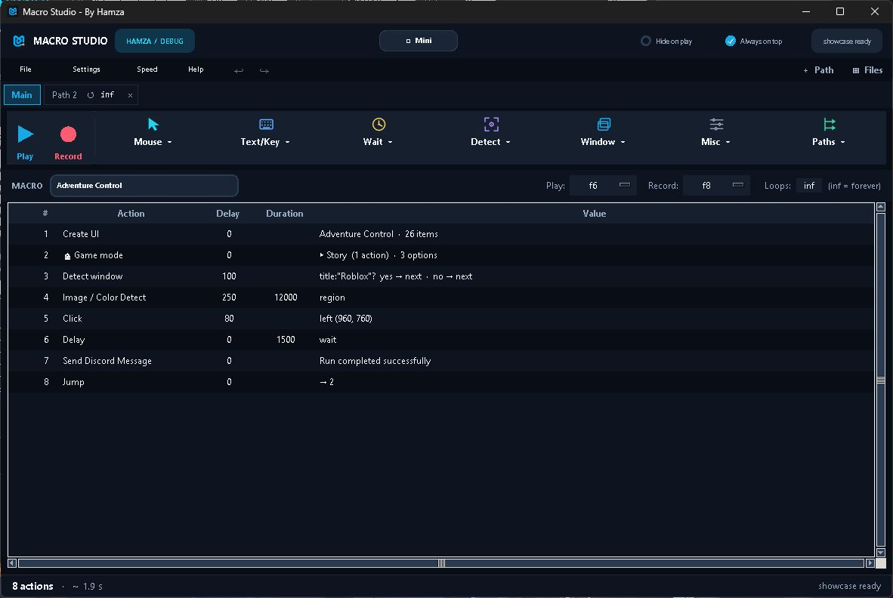
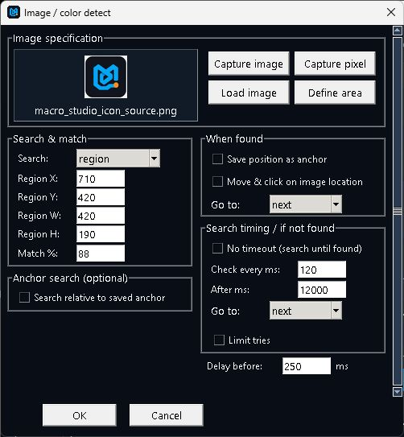
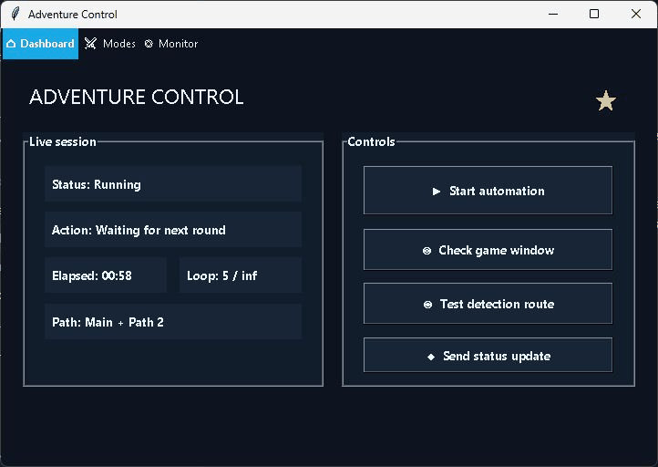
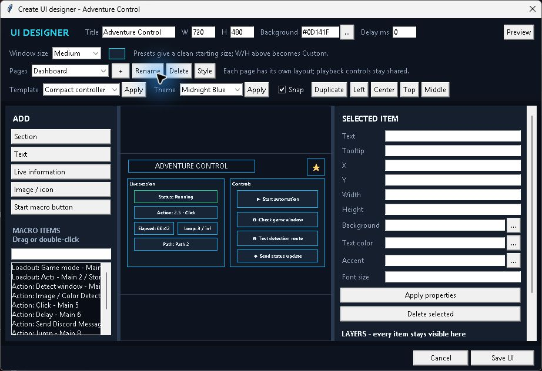
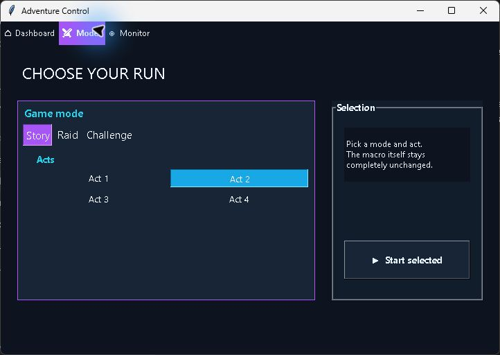
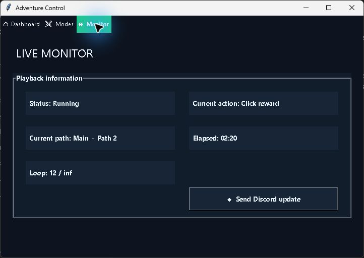
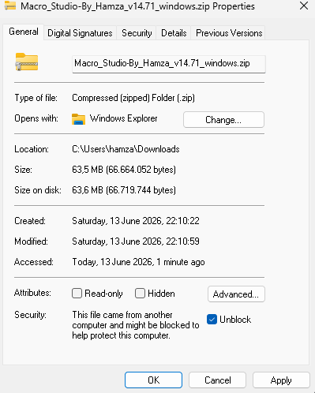

  
  <h1>Macro Studio</h1>
  
<strong>Record simple. Build advanced.</strong>

  
A Windows macro recorder and visual automation studio made by Hamza.

  
  
  

## Start here: Mini mode

  

Mini keeps the everyday workflow small: open a macro, record, save, and play. Preferences contain playback speed, continuous playback, hotkeys, always-on-top, hide-on-play, drawing, and the switch to the full editor.

Mini and the full editor use the **same macro**. Start small, then open the full editor only when you want to inspect or build more advanced behavior.

## How it works

| 1. Record | 2. Edit | 3. Add logic | 4. Run |
|---|---|---|---|
| Capture mouse movement, clicks, keys, text, and timing. | Review steps and adjust delays, positions, keys, or playback settings. | Add image/color detection, waits, jumps, paths, folders, or loadouts. | Press the play hotkey, use Mini, or monitor the run in the full editor. |

You can use Macro Studio as a straightforward recorder, or keep extending the same macro into a multi-path automation.

## Full editor

The full editor shows the actual order of actions and gives direct access to the main action groups:

- **Mouse** — move, click, scroll, drag, and relative movement.
- **Text / Key** — key presses, key holds, hotkeys, and instant or timed text.
- **Wait** — delays and wait-until conditions.
- **Detect** — image/pixel/color detection, OCR, and screen-aware branching.
- **Window** — find, focus, restore, or switch windows.
- **Misc** — folders, loadouts, Discord messages, macro chaining, and Create UI.
- **Paths** — parallel paths and jumps between actions or paths.

Actions stay visible in one numbered timeline. Folders organize the list without changing playback order, while locked jump targets keep pointing to the intended action when groups are copied or moved.

## Image and color detection

  

One **Image / Color Detect** action handles both jobs. Capture a normal image or a single pixel/color, choose the exact search area, set match accuracy and check speed, then decide what happens when it is found or times out.

Detection can also click the found location, save an anchor for a later search, limit tries, or jump to another action. The debugger can test a selected detection and show the best match before you run the whole macro.

## What you can build

| Recording and playback | Logic and organization |
|---|---|
| Smart, Exact, and Raw mouse recording | Image, pixel/color, OCR, and window detection |
| Simultaneous held keys and game-friendly input | Parallel paths, normal and dominant jumps |
| Adjustable speed, loops, delays, and hotkeys | Folders, nested loadouts, locked targets |
| Mini mode, hide-on-play, always-on-top | Macro chaining and reusable saved macros |

| Monitoring and control | Reliability |
|---|---|
| Live debugger with paths, loops, and detection results | Crash recovery and automatic work restoration |
| Step mode and selected-detection testing | Resolution-aware recorded positions |
| Discord webhooks and optional bot commands | Background-window detection and restore-window actions |
| Remote status, screenshots, and playback commands | In-app update checking and update history |

## Advanced: build a custom controller

Create UI is an optional visual playback layer for an existing macro. It does **not** reorder, copy, or replace the macro's actions. It gives the same macro an app-like controller with buttons, loadout choices, pages, images, and live playback information.

| Design it visually | Use it as the playback controller |
|---|---|
|  |  |

The designer supports pages, themes, sections, action buttons, nested loadouts, live status fields, custom images/icons, tooltips, templates, multi-select, group dragging, copy/paste, alignment, and snap guides. The normal global Play/Stop hotkey continues to work while the controller is focused, and stopping playback leaves the controller open.

<strong>More Create UI examples</strong>

| Nested loadout controls | Live playback information |
|---|---|
|  |  |

## Download

1. Open the [latest release](https://github.com/Hamza122nr2/macro-studio-updates/releases/latest).
2. Download the Windows ZIP.
3. Follow the one-time **Unblock before extracting** steps below.
4. Open the extracted folder and run `MacroStudio.exe`.

Macro Studio is portable: there is no installer. Updates can be applied from inside the app.

## Important: unblock the ZIP before extracting

Windows marks files downloaded from the internet. If the ZIP is extracted while still blocked, Windows may show warnings for files inside it. Unblock the ZIP first.

### 1. Create a permanent folder and move the ZIP there

Create the folder where you want to keep Macro Studio, move the downloaded ZIP into it, then right-click the ZIP and choose **Properties**.

### 2. Find the Unblock option

At the bottom of the General tab, the box initially looks like this:

### 3. Tick Unblock

### 4. Click Apply, then OK

After Apply, Windows removes the internet block from the ZIP.

### 5. Extract everything

Right-click the ZIP again, choose **Extract All**, and finish extraction.

After extraction:

- delete the downloaded ZIP;
- keep the extracted Macro Studio folder in its permanent location;
- optionally right-click `MacroStudio.exe` and pin it to Start or the taskbar.

## Default hotkeys

| Action | Default |
|---|---:|
| Play / Stop | `F6` |
| Stop | `F7` |
| Record | `F8` |
| Save | `Ctrl + S` |

Hotkeys, recording mode, playback speed, appearance, Discord controls, sounds, and other behavior can be changed in Settings.

## Source and safety

Macro Studio is **free to use**, but its source code is private. This public repository contains release builds, release notes, documentation, and issue tracking—not the application source.

The Windows build is currently not signed with a paid code-signing certificate, so Windows reputation warnings can still appear on a fresh download. The Unblock steps above prevent the downloaded ZIP marker from being copied into the extracted files.

## Feedback

Found a bug or have an idea? [Open a GitHub issue](https://github.com/Hamza122nr2/macro-studio-updates/issues).

See [CHANGELOG.md](CHANGELOG.md) for the complete release history.
