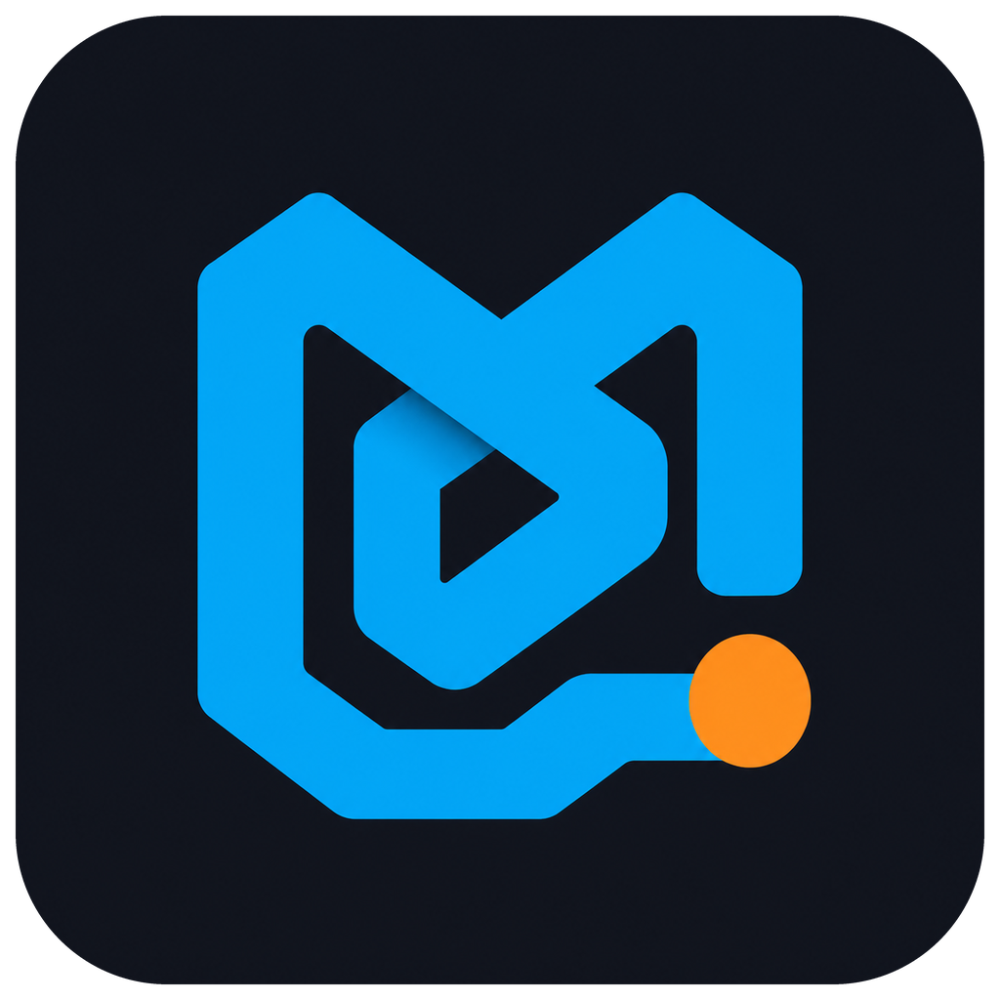
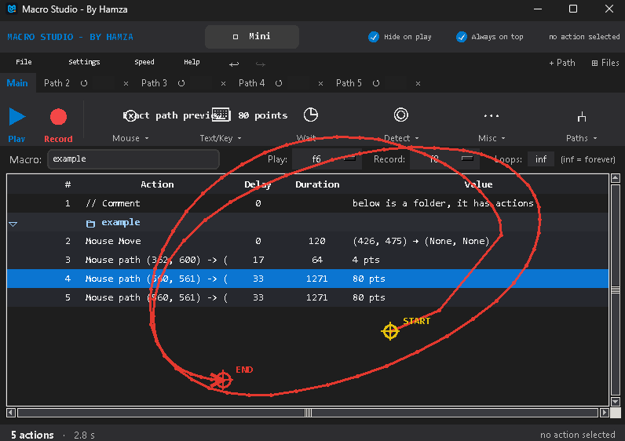
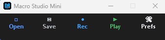
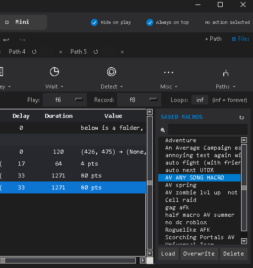
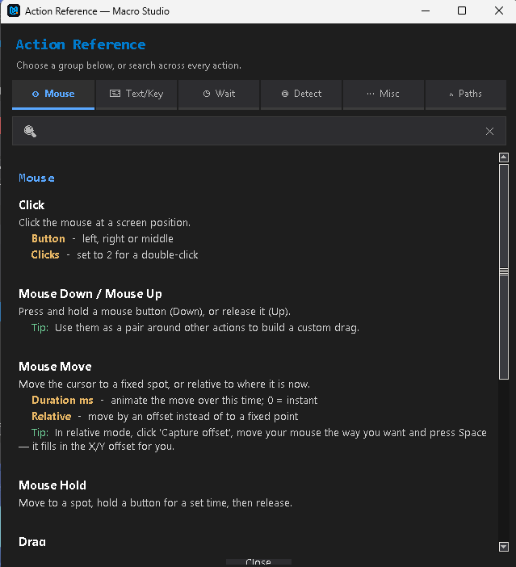
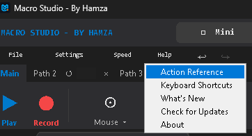
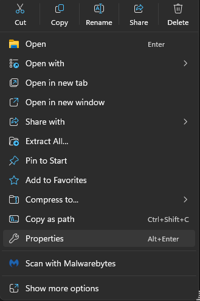
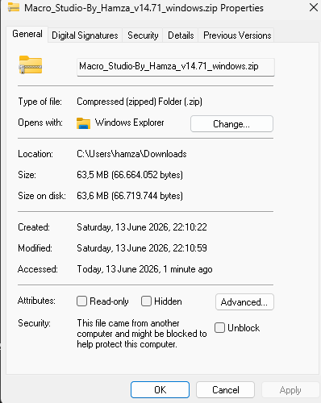
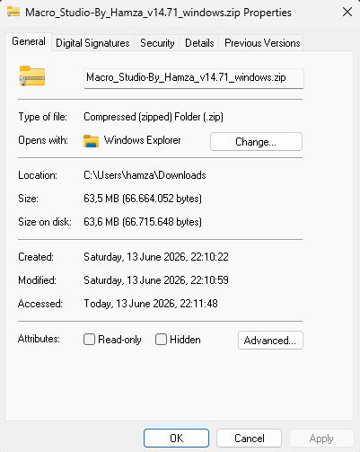
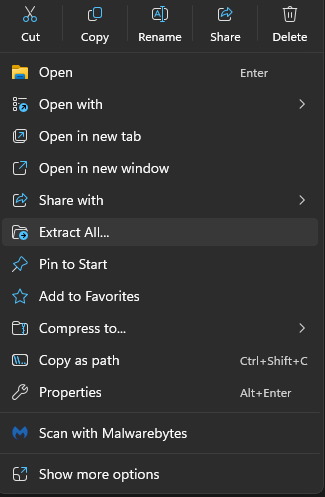

  

<h1 align="center">Macro Studio</h1>

  <strong>Windows macro automation by Hamza</strong> 
  Built for friends who were tired of TinyTask's limitations. 
  Free for anyone to use.

---

## What it does

Macro Studio lets you record and replay anything you do on screen — clicks, key presses, mouse movement, image detection, color detection, multi-step branching logic, and more. It's designed to feel simple on the surface while giving you a lot of control when you need it.

**Recording & playback**
- Smart and exact recording modes (plus raw movement capture for in-game camera control)
- Parallel action paths that run at the same time
- Loop counts per macro and per path, playback speed control, random delays
- Custom play/record hotkeys — any key or combo, not just F-keys
- Resolution scaling — macros recorded on one screen size adjust automatically on another

**Seeing the screen**
- Image detection and color detection with branching ("if found, go to step X")
- Read text (OCR) — read a counter, wave number, or any on-screen text with Windows' built-in OCR and branch on what it says
- Detect window — branch on which app/window is focused
- Built-in Debugger Mode to see exactly what image detection sees

**Logic & organization**
- Jumps between steps and paths — including jump limits ("repeat this section 10 times, then move on") and random jumps
- Chain macros together — a "Play another macro" step runs a whole saved macro, then continues
- Wait for a fixed time, until a clock time (daily resets!), or a random range
- Folders to group steps — with optional encryption, so shared macros keep their contents password-protected
- Loadouts — bundle alternative setups into one step and switch which one plays

**Quality of life**
- Mini compact mode and full editor mode
- Draw menu (Ctrl+G) — mark spots on screen while you set up a macro; marks are click-through and see-through
- Discord control & notifications — see the section below
- Searchable, color-coded Action Reference built into the Help menu
- Auto-updates from GitHub — just click Update when prompted
- Undo / redo, drag-to-reorder, multi-select, copy/paste
- Crash recovery — never lose unsaved work

---

## A look inside

**The full editor** — record clicks, key presses and real mouse movement, then see and fine-tune every step. Recorded mouse paths are even drawn right on the screen, so you can see exactly what was captured and where it starts and ends.

**Mini mode** — a tiny, always-on-top toolbar that stays out of your way while you game. Record, play, save and load without the full window in the way.

**Parallel paths & your macro library** — run several action paths at the same time, and keep every macro you've made one click away in the saved list.

**Searchable Action Reference** — every action explained, grouped by type and fully searchable, with the important options highlighted so you can find what you need fast.

**Built-in help & update notes** — open the Action Reference, keyboard shortcuts, or a "What's New" card (shown automatically after each update) right from the Help menu.

---

## Control it from Discord

Macro Studio has a Discord bot built in — nothing to host, no server to run. You create a free bot in Discord's developer portal, paste its token into Macro Studio's settings, and from that moment you can control your macro **from your phone or any device with Discord**, even while you're away from the PC.

**What you can do remotely:**
- `play` / `stop` / `pause` / `resume` / `restart` — full playback control
- `jump 2.5` — send the running macro to any step in any path
- `speed 2` / `loop 50` / `loopdelay 3s` — change playback settings live
- `status` — see what's running, which step it's on, loop progress, and uptime
- `actions` / `actions path 2` — list the macro's steps right in Discord
- `shot` — get an instant screenshot of the PC
- `autoshot 5m` — receive a screenshot every few seconds/minutes/hours so you can keep an eye on a farm overnight (it never interrupts the macro)
- announce mode — get a message automatically whenever playback ends

**Security:** the bot only listens in the one channel you choose, and only to *your* Discord account (your user ID). The token is stored locally on your PC and never leaves it.

**Setup** takes about two minutes: Settings → Discord bot → paste your bot token, channel ID and user ID. There's a built-in "Invite bot to server" button and a "Test connection" button, and `!ms help` in Discord lists every command.

Separately from the bot, there's also a **Send Discord Message action** — a normal macro step that fires a webhook message (optionally with a screenshot of the screen or a region) whenever playback reaches it. Perfect for "boss killed, run 34 done" progress pings without enabling the bot at all.

---

## How to download & run

### 1. Download

Go to the **[Releases page](https://github.com/Hamza122nr2/macro-studio-updates/releases)** and download the latest `Macro_Studio-By_Hamza_vXX.XX_windows.zip` file (under **Assets**).

### 2. Move the ZIP where you want the app to live

Before extracting, **move the downloaded ZIP** to the folder where you want Macro Studio to stay (for example a "Macro Studio" folder in Documents). Whatever folder you extract it in is where it lives — so pick the spot now.

### 3. Make it trusted (important!)

Because the app isn't "code-signed" (a certificate that costs money every year), Windows marks files downloaded from the internet as "blocked" and may show a scary warning. **It's a false positive** — Macro Studio isn't a virus; Windows is just cautious about apps from publishers it doesn't recognize, and an unsigned app always triggers this. Unblocking the ZIP **before** extracting removes that warning completely, and you won't get an antivirus pop-up afterward.

**Right-click the ZIP file and choose `Properties`:**

At the bottom of the Properties window you'll see a **Security** line that says *"This file came from another computer and might be blocked…"* with an **Unblock** checkbox — unticked by default:

**Tick the Unblock checkbox:**

Click **Apply**, then **OK**. The Security line disappears — that means it worked and the file is now trusted:

### 4. Extract

Now **right-click the ZIP again** and choose **`Extract All…`**:

### 5. Run it

Open the extracted folder and run **`MacroStudio.exe`**. No install needed.

- You can now **delete the leftover `.zip` file** — you don't need it anymore.
- **Tip:** right-click `MacroStudio.exe` → **Pin to taskbar** so it's one click to open next time.

> If Windows ever still shows a blue **"Windows protected your PC"** popup, click **More info → Run anyway**. (You normally won't see this if you unblocked the ZIP first.)

---

## Default hotkeys

- **F6** — Play / Stop
- **F8** — Record / Stop recording
- **Ctrl+G** — Draw menu (mark spots on screen)

Both hotkeys are changeable — pick a preset from the dropdown or choose **custom…** and press any key or combo you like.

---

## Found a bug or have a suggestion?

Open an issue on GitHub and I'll take a look:
**https://github.com/Hamza122nr2/macro-studio-updates/issues**
